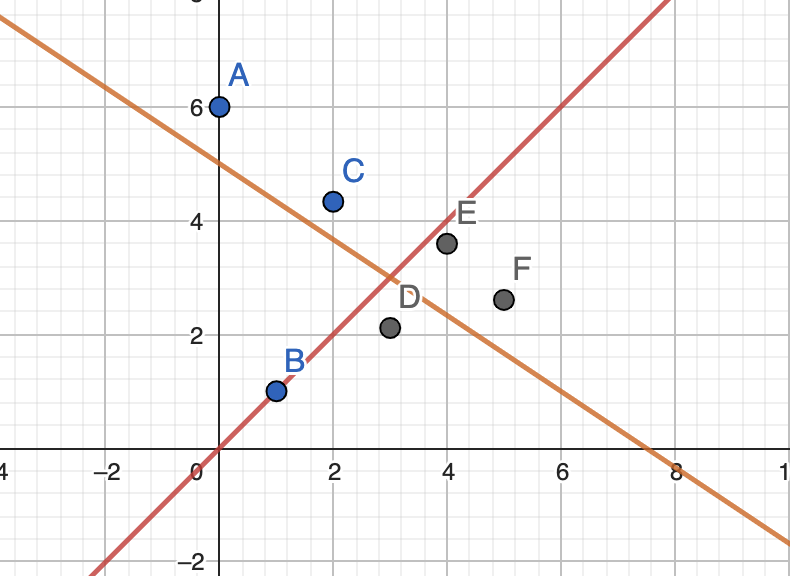
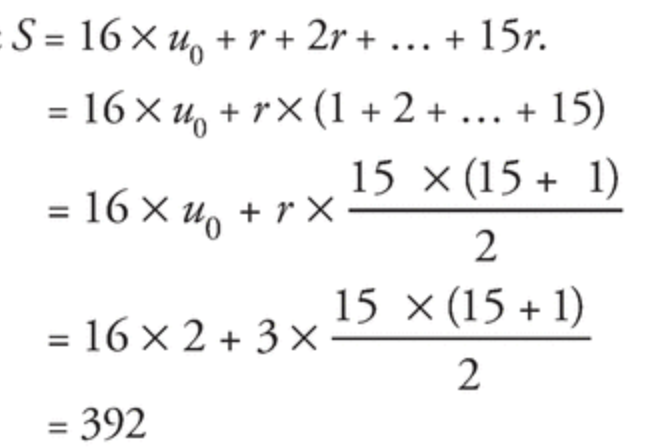

# Exercises: Digital Sequence

- [source](https://manuel.sesamath.net/numerique/index.php?ouvrage=ms1spe_2019&page_gauche=56)

# TODO

### Corrected exercises

- [x] Page 56
- [x] Page 57
- [x] Page 58
- [x] Page 59
- [x] Page 60
- [x] Page 61
- [x] Page 62
- [x] Page 63

### Application exercises

- [ ] 34-36 page 64
- [ ] 40-42 page 64
- [ ] 50-54 page 65
- [ ] 61-63 page 66
- [ ] 70-72 page 66
- [ ] 77-79 page 67
- [ ] 83-85 page 67

### Training exercises

- [ ] 88-90 page 68
- [ ] 105-107 page 69
- [ ] 116-118 page 70
- [ ] 128-129 page 71

### Deepening exercises

- [ ] 135, 137, 139 page 73
- [ ] 143,144 page 74
- [ ] 147,148,149,150 page 75

### Practical work

- [ ] 1 page 76
- [ ] 160-162 page 78
- [ ] 178-180 page 79

# Exercises

## Page 56

### 1. Calculate terms defined by an explicit formula

1. Calculate 3 first terms of the sequence $(u_n)$ defined $\forall n \in \mathbb{N}$ by $u_n = 2n +1$

> 1, 3, 5

---

### 1

1. Calculate first 4 terms of $(u_n)$ $u_n = n^3$
   > 0, 1, 3, 8
2. 10 first terms
   > 0, 1, 3, 8, 27, 64, 125, 216, 343, 512

### 2

Let $(u_b)$ a sequence, defined $u_n = -n + 5$

1. Calculate $u_0$ and $u_1$
   > $u_0 = 5$, $u_1=4$

---

### 2 Relation of recurrence

1. 3 first terms, $(u_n)$, defined by $u_0=1$ and $u_{n+1}=2u_n+1$
   > 1, 3, 7
2. 3 firsts terms, $(v_n)$, defined by $v_0=2$ and $v_{n+1}=v_n+n+3$
   > 2, 5, 9

---

### 3

1. 3 first terms, $(u_n)$, $u_0=2$, $u_{n+1}=u_n^2$
   > 2, 4, 16

### 4

Let $(w_n)$, $w_0=-1$, $w_{n+1}=-w_n+n$

1. $w_1, w_2$
   > -1, 0

---

### 3 Model with Sequence

Sport club has 500 subs in 2019. Each year 80% stay subscribed and new 20 people subscribe. $(u_n)$ is the number of subs in $2019 + n$.

1. Subs in 2020
   $$u_{n+1}=u_n\times\frac{4}{5}+20$$
   $$u_{2O20}=500\times\frac{4}{5}+20$$
   $$u_{2O20}=420$$
2. Express $u_{n+1}$ based on ${u_n}
$$u_{n+1}=u_n\times\frac{4}{5}+20$$
3. How many subs in 2030 (with calculator)
   > 134
4. When the gym hits 101 subs it will close, will it happen and when ?
   > Yes, in 2046

---

### 5

A company has 200 employees in 2019, each year 10% leave and 30 join. $(u_n)$ is the number of employees in $2019 + n$.

1. How many employees in 2020, 2021 ?
   $$u_{n+1}=u_n\times\frac{9}{10}+30$$
   $$u_{2020}=200\times\frac{9}{10}+30$$
   $$u_{2020}=210$$
   $$u_{2021}=210\times\frac{9}{10}+30$$
   $$u_{2021}=219$$
2. Express based on $n$
   $$u_{n+1}=u_n\times\frac{9}{10}+30$$

### 6

In a shop a sweater costs 60$, each period of sale the price decreases by 15%.

1. Price after first period of sale
   $$u_{n+1}=u_n\times \frac{85}{100}$$
   $$u_1=60\times \frac{85}{100}$$
   $$u_1=51$$
2. We note $(u_n)$ the price of the sweater after $n$ period of sale.

   - a. $u_0$ and $u_1$

     > 60, 51

   - b. Express based on $n$
     $$u_{n+1}=u_n\times \frac{85}{100}$$

---

### 8

Represent graphically, the 5 first terms of the sequence $(u_n)$ defined by $u_0=6$ and $u_{n+1}=\Large\frac{-2}{3}\small u_n + 5$

---

### 5 Use and recognise arithmetic sequence

1. Let, $(u_n)$ an artihmetic sequence of first term $u_0=5$ and of common difference $-2$

   - a. Give the expression of $u_n$

     > $u_{n+1}=u_n-2n$

   - b. Give value of $u_{25}$

     > $u_{25}=5-2\times{25}=-45$

2. Are the following sequences arithmetic
   $$v_n=3n-2$$
   > yes
   >
   > $v_0=-2$
   >
   > $v_1=1$
   >
   > $v_2=4$
   >
   > $v_1-v_0 = 3 = v_2-v_1$
   >
   > Demonstration
   >
   > $$v_{n+1}-v_n=[3(n+1)-2]-(3n-2)$$ > $$=3n+1-3n+2$$ > $$v_{n+1}-v_n=3$$
   > $$w_n=n^2+1$$
   > no, it is geometric
   > $$v_{n+1}-v_n=[(n+1)^2+1]-(n^2+1)$$ > $$=n^2+2n+1-n^2-1$$ > $$v_{n+1}-v_n=2n$$
   > $$w_n=\frac{n^2+n}{n}$$
   >
   > $$w_n=\frac{n^2+n}{n} = \frac{\frac{1}{n}(n^2+n)}{1} = n + 1$$
   > $$w_{n+1}-w_n=(n+2)-(n+1)$$
   > $$w_{n+1}-w_n=1$$

---

### 9

Let, $(u_n)$ an arithmetic sequence of $u_0=-2$ and of common difference $3$

1. Give the expression of $u_n$
   > $u_{n+1}=u_n+3$
2. Indentify the value of $u_{20}$
   > $u_{20}=-2+20\times{3}=58$

### 10

Are the following suites arithmetic

1. $v_n=\sqrt{n}$
   > no
   > $$\sqrt{2} - \sqrt{1} \ne \sqrt{3} - \sqrt{2}$$
2. $w_n=-n+4$
   > yes
   > $$w_{n+1}-w_n=(-n-1+4)-(-n+4)$$ > $$w_{n+1}-w_n=-n+3+n-4$$ > $$w_{n+1}-w_n=-1$$

---

### 6

Let $(u_n)$ be a geometrical sequence of common ratio $2$ such as $u_2=\Large\frac{1}{4}$

1. Give the expression $u_n$ depending on $n$

- a. $u_n$
  $$\forall n \in \mathbb{N}, \forall p \in \mathbb{N} \space u_{n+p}=u_p\times{q^{n-p}}$$
  $$u_n=\frac{1}{4}\times{2^{n-2}}$$
- b. Value of $u_6$
  $$u_6=\frac{1}{4}\times{2^4} = 4$$

2. Are the following sequences geometric
   $$u_n=n^2+1$$
   > No
   > $$u_0=0+1=1$$ > $$u_1=1+1=2$$ > $$u_2=4+1=5$$ > $$\frac{u_0}{u_1}\ne\frac{u_1}{u_2}$$
   > $$u_n=2^{n+1}$$
   > yes
   > $$\frac{u_{n+1}}{u_n}=\frac{2^{n+2}}{2^{n+1}}=2$$
   > $$u_n=\frac{1}{n}$$
   > No
   > $$u_1=\frac{1}{1}=1$$ > $$u_2=\frac{1}{2}$$ > $$u_3=\frac{1}{3}$$ > $$\frac{u_2}{u_1}\ne\frac{u_3}{u_2}$$

---

### 11

Let $(u_n)$ be a geometrical sequence of $u_0=-2$ and of common ratio 2.

1. Give the expression of $u_n$ based on $n$
   $$u_n=-2\times{2^n}$$
2. What is the value of $u_{10}$
   $$u_{10}=-2\times{2^{10}}=–2\times{1024}=-2048$$

### 12

Are the following sequences geometric?
$$v_n=\sqrt{n}$$

> No
> $$u_0=0$$ > $$u_1=1$$ > $$u_2=\sqrt{2}$$ > $$\frac{u_1}{u_0}\ne\frac{u_2}{u_1}$$
> $$w_n=\frac{1}{3^n}$$
> Yes
> $$\frac{w_{n+1}}{w_n}=\frac{\frac{1}{3^{n+1}}}{\frac{1}{3^n}}=\frac{\frac{1}{3}\times{3^{n+1}}}{\frac{1}{3}\times{3^n}}=3$$

---

### 7. Sums for arithmetic and geometric sequences

1. Calculate the sum of $101+102+103+...+998+999$
   $$1+2+...+n=\frac{n(n+1)}{2}$$
   $$\frac{999(999+1)}{2} - \frac{100(100+1)}{2} = 494,450$$
2. $(u_n)$ is an arithmetic sequence defined by $u_0=2$ and of common difference 3. Calculate the sum $S=u_0+u_1+...+u_{15}$
   $$S=15 \times \frac{u_0+u_{15}}{2}$$
   $$S=15 \times \frac{2+47}{2}$$
   $$S=392$$
   > 
3. $(u_n)$ a geometric sequence defined by $u_0=3$ and of common difference 2. Calculate the sum of the first 20 terms.
   $$S=u_0+u_1+...+u_{19}$$
   $$u_n=u_0\times{q^n}$$
   $$S = 3 + (3\times{2^1}) + ... + (3\times{2^{19}})$$
   $$S = 3(2^0+2^1+...+2^{19})$$
   $$S = 3 \times \frac{1-q^{n+1}}{1-q}$$
   $$S = 3 \times \frac{1-2^{20}}{-1}$$
   $$S = 3,145,725$$

---

### 13.

Calculate the following sums

1. $1+2+...+150 = \large\frac{150\times 151}{2}\small = 11,325$
2. $50 + 51 + ... + 150 = \large\frac{150\times 151}{2} \small- \large\frac{49\times 50}{2}\small = 10,100$

### 14.

Calculate the following sums

- a) $1 + \frac{1}{2} + \frac{1}{2^2} + ... + \frac{1}{2^{16}}$
  $$\frac{\frac{1}{2^{16}}(\frac{1}{2^{16}}+1)}{2} = 7\times10^{-6}$$
- b) $1 + \frac{1}{2} + \frac{1}{2^2} + ... + \frac{1}{2^{10}}$
  $$\frac{\frac{1}{2^{10}}(\frac{1}{2^{10}}+1)}{2} = 488\times10^{-6}$$
- b) $\frac{1}{2^{11}} + \frac{1}{2^{12}} + ... + \frac{1}{2^{16}}$
  $$-4.81\times 10^{-4}$$

### 15.

1. Let $(u_n)$ be an arithmetic sequence defined by $u_0=-2$ and $d = 4$. Calculate the sum of the first 21 terms.
   $$u_n = u_0 + d\times n$$
   $$S = u_0 + (u_0+d\times 1) + (u_0+d\times 2) + ... + (u_0+d\times 20)$$
   $$S = 21 \times u_0 + (d+2d+...+20d)$$
   $$S = 21 \times u_0 + d \times (1+2+...+20)$$
   $$S = 21 \times -2 + 4 \times \frac{20 \times 21}{2}$$
   $$S = -38 \times 210$$
   $$S = -7,980$$

2. Let $(u_n)$ be a geometrical sequence defined by $u_0=\frac{1}{2}$ and common ratio 3. Calculate the sum of the first 10 terms.

$$u_n = u_0 \times 3^n$$
$$S = u_0+u_1+...+u_9$$
$$S = u_0(1+1^3+2^3+...+9^3)$$
$$S = \frac{1}{2}\frac{1-3^{10}}{1-3}$$
$$S = \frac{1-3^{10}}{2(1-3)}$$
$$S = 14,762$$

### 16.

$(u_0)=4$, common difference -3

1. Calculate $u_0+u_1+...+u_{50}$
   $$S = 51\times\frac{-142}{2} = -3,621$$
2. Sum, 20 first terms
   $$S = 20\times\frac{-49}{2} = -490$$
3. Guess the sum of $u_{20}+...u_{50}$
   $$-3,621 + 490 = -3131$$

---

### 8 Sequence variations

Study the variations of the sequence $(u_n)$ for $n \in \mathbb{N}$:

a) $u_n = n^2 + n$
