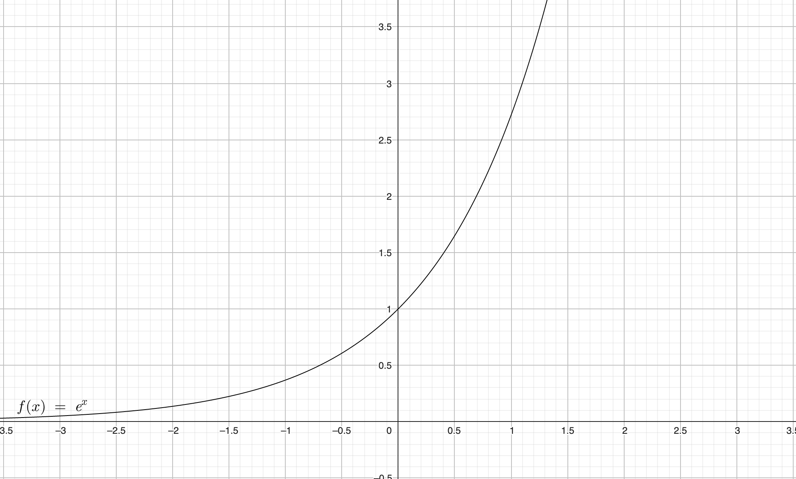

# Exponential Function

## 1.

Unique function such as:
$$f(0) = 1$$
$$f' = f$$

Exponential fonction noted $exp$

## 2. Algebric properties

### Sum:

$\forall\space\mathbb{R}$ $a$ and $b$
$$exp(a+b) = exp(a) \times exp(b)$$

### Opposed, difference and power

- $a \in \mathbb{R} \space exp(-a) = \frac{1}{exp(a)}$
- $a \in \mathbb{R}$ and $b \in \mathbb{R} \space exp(a-b) = \frac{exp(a)}{exp(b)}$
- $n \in \mathbb{N}, a \in \mathbb{R} \space \rm{exp}(a)^n = \rm{exp}(na)$

## 3. New notation and e number

### Definition: e number

Image of $1$ by the exp function. $exp(1) = e$

### Properties: New notation and algebric properties

- $a \in \mathbb{R}$ and $b \in \mathbb{R} e^{a+b} = e^a \times e^b$
- $a \in \mathbb{R}$ and $e^a \ne 0 e^{-a} = \frac{1}{e^a}$
- $a \in \mathbb{R}$ and $b \in \mathbb{R} e^{a-b} = \frac{e^a}{e^b}$
- $a \in \mathbb{R}$ and $n \in \mathbb{N} (e^a)^n = e^{na}$

## 4. Relation with geometrical sequences

### Property: Exponential and geometrical sequence

$a \in \mathbb{R}$ The sequence $(u_n)$ for $n \in \mathbb{N}$ and for $u_n = e^{na}$. Is a geometrical sequence of common ratio $e^a$.

## 5. Analytic properties

### Property: Sign of the exponential

$\forall x \in \mathbb{R}$, we have $e^x > 0$

### Property: Variations of the exp function

Strictly increasing over $\mathbb{R}$

### Property: Exponential and square rooit

$$\sqrt{e} = e^{\frac{1}{2}}$$

### Property: Exponential of affine function

$f(x) = e^{u(x)}$
where
$u(x) = ax+b$

So $f$ is derivable and $f'(x) = a \times e^{u(x)} = a \times f(x)$

## 6. Representative curve of the exp function

### Property: Graphical representation

